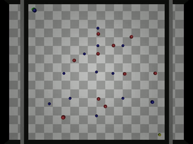
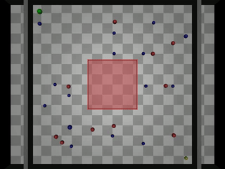
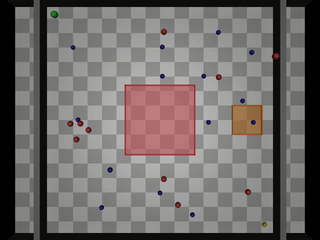
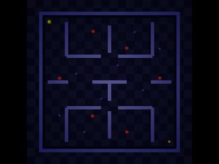
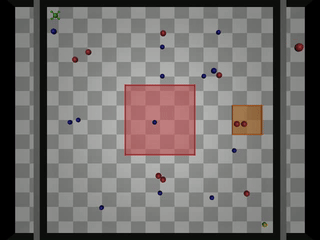

# 2D MuJoCo Experiments — Hybrid GNN+LLM Navigation

## Overview

2D robot navigation experiments in MuJoCo, where a robot must navigate from `(-3.6, -3.6)` to `(3.6, 3.6)` in an 8×8m arena filled with dynamic and static obstacles, no-fly zones, or maze walls.

The **Hybrid GNN+LLM** framework uses a **Sample-Filter-Select** pipeline:
1. **Sample** — Generate 16 candidate velocity directions
2. **Filter (GNN)** — LocalRiskGNN scores each for collision risk, removes unsafe ones
3. **Select (LLM)** — Among safe candidates, pick the one aligned with LLM strategic bearing

---

## 📁 File Reference

### Core Hybrid Framework
| File | Description |
|------|-------------|
| `hybrid_nav.py` | Core navigation classes: `HybridController`, `GNNSafetyChecker`, `StrategicNavigator` |
| `run_gnn_llm_hybrid.py` | Main runner for mixed-obstacle environment (20 obstacles) |

### Experiment Scripts
| File | Description |
|------|-------------|
| `nfz_experiment.py` | Single L-shaped No-Fly Zone + 25 obstacles. Methods: APEX, HYBRID |
| `medium_nfz_experiment.py` | Dual NFZ zones + 25 obstacles. Methods: APEX, PULSE, HYBRID |
| `pacman_maze_experiment.py` | Pac-Man style walled maze. Methods: APEX, PULSE, HYBRID |
| `drone_hybrid_experiment.py` | Drone-like physics model + NFZ. Methods: APEX, PULSE, HYBRID |
| `run_all_nfz.py` | Batch runner: runs all methods on NFZ environment |
| `run_all_medium_nfz.py` | Batch runner: runs all methods on Medium NFZ |
| `run_all_pacman_maze.py` | Batch runner: runs all methods on Pac-Man Maze |

### Environments (`env/`)
| File | Description |
|------|-------------|
| `nfz_env.xml` | Single L-shaped NFZ MuJoCo environment |
| `medium_nfz_env.xml` | Dual NFZ MuJoCo environment |
| `pacman_maze_env.xml` | Pac-Man maze with wall corridors |
| `mixed_env_20.xml` | 20 mixed obstacles (10 dynamic + 10 static) |
| `mixed_random_env_*.xml` | Randomized obstacle variants |
| `available_move.json` | Robot action space definition |
| `drone_available_move.json` | Drone-specific action space |
| `pacman_env.py` | Pac-Man MuJoCo environment wrapper |
| `pacman_agents.py` | Pac-Man ghost agents (dynamic obstacles) |

### GNN Models (`model/`)
| File | Description |
|------|-------------|
| `local_risk_gnn.py` | LocalRiskGNN — graph neural network for collision risk scoring |
| `graphormer.py` | DiffGraphormer architecture (attention-based graph model) |
| `diffgraphormer_physics.pt` | Trained Graphormer weights |
| `diffgat_physics.pt` | Trained GAT weights |
| `diffgcn_physics.pt` | Trained GCN weights |
| `data/train_data_gen.py` | Training data generation script |
| `data/reverse_graphormer_data.json` | Training dataset |

### Utilities (`utils/`)
| File | Description |
|------|-------------|
| `APEX.py` | Original APEX agent logic |
| `mujoco_simulator.py` | MuJoCo body state extraction utilities |
| `cat_game_agent.py` | Cat game agent (GPT-4o integration) |
| `cat_game_agent_other_llms.py` | Alternative LLM integration |

---

## 🧪 Experiment Details

### 1. Mixed Obstacle Navigation
- **Arena**: 8×8m with 20 obstacles (10 dynamic cats, 10 static)
- **Goal**: Navigate from corner to corner
- **Run**: `python run_gnn_llm_hybrid.py`

### 2. No-Fly Zone (NFZ)
- **Arena**: L-shaped NFZ blocking the direct diagonal path + 25 obstacles
- **Goal**: Navigate around NFZ without entering it
- **Run**: `python nfz_experiment.py --method HYBRID`

### 3. Medium NFZ (Dual Zones)
- **Arena**: Center NFZ `[-1.2, 1.2]²` + Top-right NFZ `[2.2, 3.2]²` + 25 obstacles
- **Goal**: Navigate between two restricted zones
- **Run**: `python medium_nfz_experiment.py --method HYBRID`

### 4. Pac-Man Maze
- **Arena**: Walled maze with corridors (like Pac-Man)
- **Goal**: Navigate through tight corridors without wall collisions
- **Run**: `python pacman_maze_experiment.py --method HYBRID`

### 5. Drone Hybrid
- **Arena**: Drone-like physics with NFZ
- **Goal**: Navigate with realistic drone movement constraints
- **Run**: `python drone_hybrid_experiment.py`

---

## 📊 Performance (Hybrid GNN+LLM)

| Experiment | Avg Time | Collisions | Success |
|-----------|----------|------------|---------|
| Mixed Obstacle | ~4.5s | 0.75/run | 100% |
| NFZ | ~6s | 0 NFZ violations | 100% |
| Medium NFZ | ~7s | 0 NFZ violations | 100% |
| Pac-Man Maze | ~8s | 0 wall hits | 100% |
