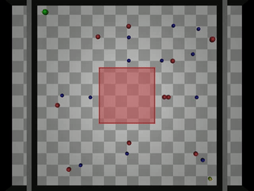
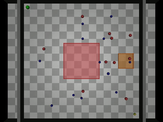
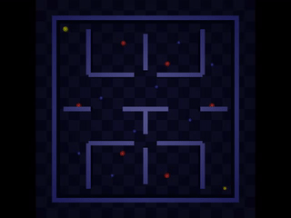

# 2D Experiment Videos

## Featured Runs (inline GIF previews)

### Mixed Obstacle Navigation

### No-Fly Zone (NFZ)

**Best Run:**

### Medium NFZ (Dual Zones)

**Best Run:**

### Pac-Man Maze

**Best Run (fastest):**

### Drone Hybrid

**Best Run (fastest):**

---

## Full Video Index

| File | Experiment | Notes |
|------|-----------|-------|
| `hybrid_gnn_llm_mixed_obstacle.mp4` | Mixed 20-obstacle | Standard run |
| `nfz_hybrid.mp4` | NFZ avoidance | Standard run |
| `nfz_hybrid_best_run2.mp4` | NFZ avoidance | **Best run** |
| `medium_nfz_hybrid.mp4` | Dual NFZ | Standard run |
| `medium_nfz_hybrid_best.mp4` | Dual NFZ | **Best run (fastest)** |
| `pacman_maze_hybrid.mp4` | Pac-Man maze | Standard run |
| `pacman_maze_hybrid_best.mp4` | Pac-Man maze | **Best run (fastest)** |
| `drone_hybrid.mp4` | Drone physics | Standard run |
| `drone_hybrid_best.mp4` | Drone physics | **Best run (fastest)** |
