# 3D Drone Experiment Videos

## `hybrid/` — Standard Hybrid Controller

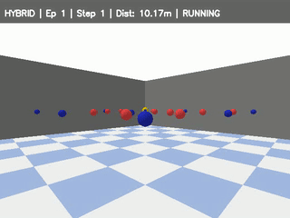

**Best Runs (fastest episodes):**

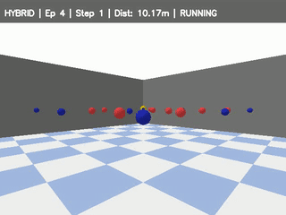

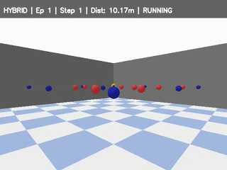

---

## `nfz/` — NFZ-Aware Hybrid Controller

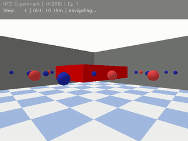

**Best Runs:**

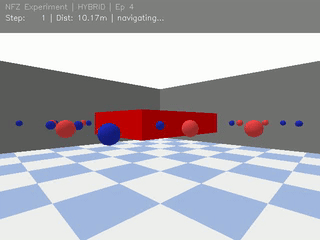

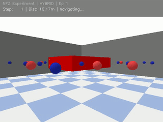

---

## `gnn_llm/` — GNN+LLM Combined Controller

### Standard Environment
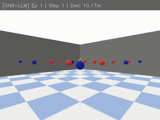

**Best Runs:**

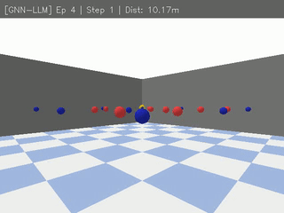

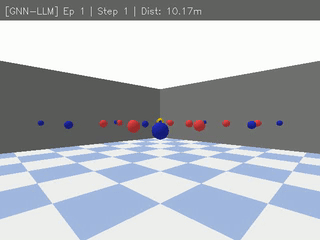

### NFZ Environment
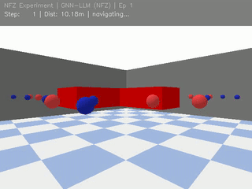

**Best Runs:**

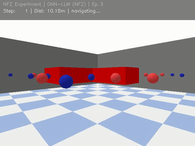

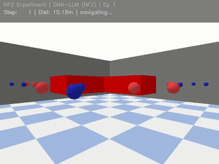

---

## `explicit_llm/` — Explicit LLM Controller

### Standard Environment
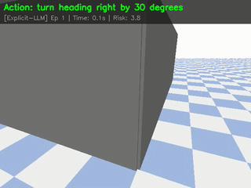

**Best Runs:**

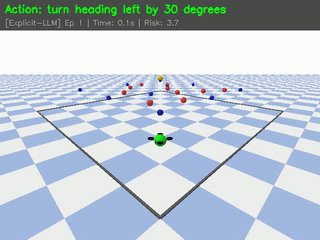

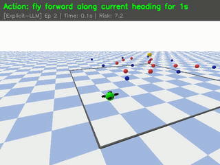

### NFZ Environment
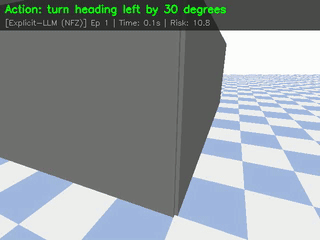

**Best Run:**

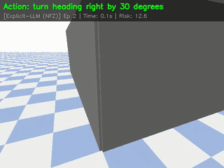

---

## Action Logs (Explicit LLM)

| File | Description |
|------|-------------|
| `3d_explicit_llm_action_log.txt` | Standard run action log |
| `3d_explicit_llm_best_ep1_action_log.txt` | Best ep1 action log |
| `3d_explicit_llm_best_ep2_action_log.txt` | Best ep2 action log |
| `3d_explicit_llm_nfz_action_log.txt` | NFZ run action log |
| `3d_explicit_llm_nfz_best_ep2_action_log.txt` | NFZ best run action log |

> Action logs contain timestamped LLM decisions:
> ```
> [00.05s] LLM ACTION SELECTED: turn heading right by 30 degrees (Type: rotate)
> [01.05s] LLM ACTION SELECTED: fly forward along current heading for 1s (Type: translate)
> ```
